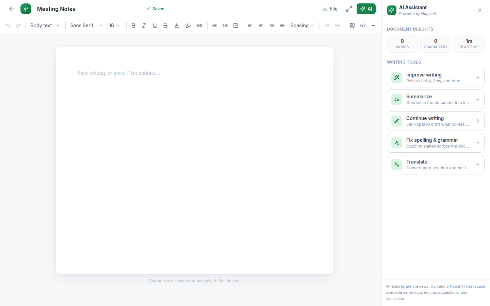

# Nopal AI Docs

A professional, web-based document editor — think Google Docs / Microsoft Word, reimagined with a clean, premium **Nopal AI** identity. Create, format, import, export, and manage rich documents entirely in the browser.

Built with **Next.js (App Router) · TypeScript · Tailwind CSS · TipTap**.



## Features

### Rich document editor
A real WYSIWYG editor (not a textarea) powered by [TipTap](https://tiptap.dev) / ProseMirror:

- Document title editing with an auto-save status indicator
- Undo / redo
- Font family & font size selectors
- **Bold**, _italic_, underline, ~~strikethrough~~, subscript/superscript
- Text color & highlight color pickers
- Block styles: **Title**, **Subtitle**, Heading 1–3, Body text
- Bulleted lists, numbered lists, and interactive **checklists**
- Text alignment: left / center / right / justify
- Line spacing presets
- Indent / outdent (list nesting)
- Block quotes, code blocks, horizontal dividers, links
- Page-style writing area with a premium look
- Full-screen / focus writing mode
- Fully responsive (desktop, tablet, mobile)

### Import
Open files straight from your device — formatting is preserved as faithfully as possible:

| Format | Engine |
| ------ | ------ |
| `.docx` | [mammoth](https://github.com/mwilliamson/mammoth.js) |
| `.md` / `.markdown` | [marked](https://marked.js.org) |
| `.html` / `.htm` | native (body extraction) |
| `.txt` | native |

### Export
Save your document to your device in multiple formats:

| Format | Engine |
| ------ | ------ |
| **PDF** | native print-to-PDF (crisp, selectable, vector text) |
| **Word `.docx`** | [html-docx-js-typescript](https://www.npmjs.com/package/html-docx-js-typescript) |
| **Markdown `.md`** | [turndown](https://github.com/mixmark-io/turndown) |
| **Text `.txt`** | native |
| **HTML `.html`** | native (self-contained, styled) |

### Document dashboard
- Grid of all your documents with live previews
- Create, **rename**, **duplicate**, and **delete**
- **Search** by title/content
- **Sort** by last modified, title (A–Z), or date created
- Click to reopen in the editor

### AI assistant panel
- Live **document insights** (word count, character count, reading time) — fully functional
- Writing-tool placeholders (Improve writing, Summarize, Continue writing, Fix grammar, Translate) wired to the editor and ready to connect to a Nopal AI backend

## Architecture

The app is structured so the current **localStorage** persistence can later be swapped for a real backend (accounts, cloud sync, sharing, version history, collaboration) without touching the UI.

```
src/
├── app/
│   ├── layout.tsx            # Root layout, fonts, metadata
│   ├── page.tsx              # Dashboard page
│   ├── editor/[id]/page.tsx  # Editor route (loads a document)
│   ├── globals.css           # Tailwind + ProseMirror content styles
│   └── icon.svg              # App icon
├── components/
│   ├── Logo.tsx              # Nopal AI wordmark (original artwork)
│   ├── ui/Modal.tsx
│   ├── dashboard/DocumentCard.tsx
│   └── editor/
│       ├── DocumentEditor.tsx    # Editor shell: header, autosave, fullscreen
│       ├── Toolbar.tsx           # Full formatting toolbar
│       ├── ToolbarPrimitives.tsx # Reusable buttons / dropdowns
│       ├── FileMenu.tsx          # New / Open / Save / Export menu
│       └── AiPanel.tsx           # AI assistant side panel
└── lib/
    ├── types.ts              # Domain types + DocumentStore interface
    ├── store.ts              # localStorage implementation of DocumentStore
    ├── useDocuments.ts       # Dashboard data hook
    ├── import.ts             # File import (docx/md/html/txt → HTML)
    ├── export.ts             # File export (pdf/docx/md/txt/html)
    ├── editorExtensions.ts   # TipTap extension set
    ├── fontSize.ts           # Custom font-size extension
    ├── lineHeight.ts         # Custom line-height extension
    ├── headingStyle.ts       # Title/Subtitle heading variants
    └── constants.ts
```

### Swapping in a backend

Every data operation goes through the `DocumentStore` interface in `src/lib/types.ts`. All methods are already `async`, so providing an API-backed implementation (and pointing the hooks at it) is the only change required:

```ts
export interface DocumentStore {
  list(): Promise<DocumentRecord[]>;
  get(id: string): Promise<DocumentRecord | null>;
  create(input?: NewDocumentInput): Promise<DocumentRecord>;
  update(id: string, patch: DocumentPatch): Promise<DocumentRecord>;
  duplicate(id: string): Promise<DocumentRecord>;
  remove(id: string): Promise<void>;
}
```

## Getting started

```bash
npm install
npm run dev      # http://localhost:3000
```

Other scripts:

```bash
npm run build      # production build
npm run start      # serve the production build
npm run typecheck  # tsc --noEmit
```

## Notes

- Documents are stored in your browser's `localStorage`. They are private to that browser/device and are not uploaded anywhere.
- PDF export uses the browser's native print dialog (choose **Save as PDF**) for the highest fidelity and selectable text.
- AI writing tools are clearly-labeled previews until a Nopal AI workspace is connected; the document context they need is already wired up.
